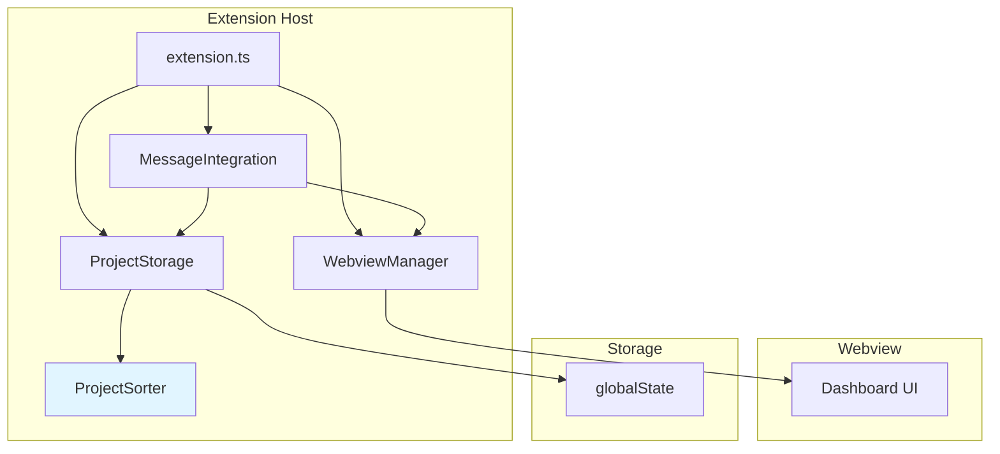

# Design Document: プロジェクトリストのアルファベット順ソート

## Overview

**Purpose**: VSCode Start Board拡張機能において、プロジェクトリストをアルファベット順に表示することで、ユーザーのプロジェクト検索性と一覧性を向上させる。

**Users**: VSCode Start Boardを使用して複数のプロジェクトを管理する開発者が、ダッシュボードでプロジェクトを素早く見つけるためにこの機能を利用する。

**Impact**: 現在のプロジェクトリスト表示（登録順）をアルファベット順（昇順）に変更。既存のプロジェクトデータは変更せず、表示順のみを変更する。

### Goals
- プロジェクト名のアルファベット順（昇順）でのソート表示を実現
- 大文字小文字を区別しない、Unicode/日本語対応のソート
- VSCode再起動後もソート順を維持（永続化）
- パフォーマンス要件を満たす（100件で10ms以内、1000件で100ms以内）
- 既存のプロジェクトデータとの完全な互換性

### Non-Goals
- ソート順のカスタマイズ機能（降順、更新日時順など）は対象外
- プロジェクト名の編集機能は対象外
- プロジェクトのグループ化やカテゴリ分類は対象外
- ソート順の手動変更（ドラッグ＆ドロップ）は対象外

## Architecture

### Existing Architecture Analysis

**現在のアーキテクチャパターン**:
- **フラットモジュール構成**: 機能ごとにモジュール分割し、`src/`直下に配置
- **VSCode拡張機能パターン**: Extension Host ↔ Webview間のメッセージパッシング
- **永続化**: `ExtensionContext.globalState`を使用したプロジェクトリストの保存
- **型安全性**: TypeScript strict mode、明示的な型定義（`types.ts`）

**既存のドメイン境界**:
- **ProjectStorage**: プロジェクトリストの永続化と操作（追加、削除、取得）を担当
- **WebviewManager**: Webviewのライフサイクル管理とメッセージ通信を担当
- **MessageIntegration**: Extension ↔ Webview間のメッセージ統合を担当
- **CommandHandlers**: VSCodeコマンドハンドラー（プロジェクト追加）を担当

**維持すべき統合ポイント**:
- `ProjectStorage.getProjects()` のインターフェース（戻り値: `Project[]`）
- `Project` 型定義（id, name, path, type, addedAt）
- Extension → Webview メッセージプロトコル（`ExtensionToWebviewMessage`）
- globalStateのストレージキー（`startBoard.projects`）

**技術的負債への対応**:
- 現在の`getProjects()`は未ソートの配列を返すが、これをソート済み配列に変更
- 呼び出し側（extension.ts, messageIntegration.ts）の変更は不要（後方互換性維持）

### Architecture Pattern & Boundary Map

**アーキテクチャ統合**:
- **選定パターン**: モジュラー設計 + ユーティリティモジュール分離
- **ドメイン/機能境界**:
  - `ProjectStorage`: 永続化ドメイン（既存）
  - `ProjectSorter`: ソートロジックドメイン（新規）
- **既存パターンの保持**: フラットモジュール構成、依存性注入パターン（テストのため）
- **新規コンポーネントの根拠**:
  - `ProjectSorter`: 単一責任原則に従い、ソートロジックを分離
- **ステアリング準拠**: `structure.md`（フラットモジュール）、`tech.md`（TypeScript strict mode）に準拠



**Key Decisions**:
- `ProjectSorter`を新規モジュールとして追加し、`ProjectStorage.getProjects()`から内部的に呼び出す
- 既存の`Project`型定義は変更せず、ソート関数は純粋関数として実装
- Webviewへのメッセージプロトコルは変更不要（ソート済み配列をそのまま送信）

### Technology Stack

| Layer | Choice / Version | Role in Feature | Notes |
|-------|------------------|-----------------|-------|
| Language | TypeScript 5.3+ | ソートロジックの実装 | strict mode有効、型安全性確保 |
| Runtime | Node.js (ES2022 target) | JavaScriptエンジン | V8エンジンのTimsortを使用 |
| Standard Library | Array.prototype.sort() | ソートアルゴリズム | O(n log n)、外部依存なし |
| Standard Library | String.prototype.localeCompare() | 文字列比較 | Unicode/日本語対応、大文字小文字正規化 |
| Testing | Mocha + assert | ユニットテスト | 既存テストフレームワーク |

**Technology Alignment**:
- 新しい外部依存関係なし（JavaScriptの標準ライブラリのみ使用）
- 既存の技術スタックと完全に互換性あり
- VSCode拡張機能の軽量性を維持

## System Flows

**Note**: このセクションはシンプルなCRUD変更のためスキップ可能。ソートロジックは`ProjectStorage.getProjects()`内で完結し、複雑なフローは存在しない。

データフロー概要（テキスト説明）:
1. ダッシュボード表示時またはプロジェクト更新時に`ProjectStorage.getProjects()`を呼び出し
2. `getProjects()`内で`ProjectSorter.sortProjectsAlphabetically()`を呼び出し
3. ソート済みプロジェクト配列を返す
4. Extension → Webviewメッセージでソート済み配列を送信
5. Webviewがソート済みリストを表示

## Requirements Traceability

| Requirement | Summary | Components | Interfaces | Notes |
|-------------|---------|------------|------------|-------|
| 1.1 | アルファベット順（昇順）でソート | ProjectSorter, ProjectStorage | `sortProjectsAlphabetically()` | `localeCompare()`使用 |
| 1.2 | Unicode/日本語対応 | ProjectSorter | `sortProjectsAlphabetically()` | `localeCompare()`のUnicode対応 |
| 1.3 | 大文字小文字を区別しない | ProjectSorter | `sortProjectsAlphabetically()` | `toLowerCase()`で正規化 |
| 1.4 | 新規追加時の再ソート | ProjectStorage | `getProjects()` | 毎回ソート実行 |
| 1.5 | プロジェクト名のみでソート | ProjectSorter | `sortProjectsAlphabetically()` | `Project.name`のみ使用 |
| 2.1 | ソート順をglobalStateに保存 | ProjectStorage | `getProjects()` | 既存の永続化メカニズム |
| 2.2 | VSCode再起動後の復元 | ProjectStorage | `getProjects()` | 既存の永続化メカニズム |
| 2.3 | 削除時のソート順維持 | ProjectStorage | `removeProject()` | 既存のまま変更不要 |
| 3.1 | 既存データの自動ソート | ProjectStorage | `getProjects()` | 読み込み時にソート |
| 3.2 | エラーハンドリング | ProjectStorage | `getProjects()` | 既存のバリデーション維持 |
| 3.3 | `Project`型互換性 | - | `Project` | 型定義変更不要 |
| 4.1 | 100件で10ms以内 | ProjectSorter | `sortProjectsAlphabetically()` | パフォーマンステストで検証 |
| 4.2 | 1000件で100ms以内 | ProjectSorter | `sortProjectsAlphabetically()` | パフォーマンステストで検証 |
| 4.3 | O(n log n)のソート | ProjectSorter | `sortProjectsAlphabetically()` | `Array.sort()`はTimsort |

## Components and Interfaces

**Component Summary**:

| Component | Domain/Layer | Intent | Req Coverage | Key Dependencies | Contracts |
|-----------|--------------|--------|--------------|------------------|-----------|
| ProjectSorter | Utility | プロジェクトリストのソート | 1.1, 1.2, 1.3, 1.5, 4.1, 4.2, 4.3 | なし（標準ライブラリのみ） | Service |
| ProjectStorage (変更) | Persistence | プロジェクトリストの永続化とソート適用 | 1.4, 2.1, 2.2, 2.3, 3.1, 3.2 | ProjectSorter (P0) | Service, State |

### Utility Layer

#### ProjectSorter

| Field | Detail |
|-------|--------|
| Intent | プロジェクトリストをアルファベット順にソートする純粋関数を提供 |
| Requirements | 1.1, 1.2, 1.3, 1.5, 4.1, 4.2, 4.3 |
| Owner / Reviewers | - |

**Responsibilities & Constraints**
- プロジェクト配列をアルファベット順（昇順）にソート
- 大文字小文字を区別しない比較
- Unicode/日本語文字列の正しいソート順序
- 同名プロジェクトの場合は`addedAt`でセカンダリソート
- ステートレスな純粋関数（副作用なし）

**Dependencies**
- Inbound: ProjectStorage — プロジェクト配列のソート (P0)
- Outbound: なし
- External: JavaScript標準ライブラリ（Array.sort, String.localeCompare） — ソートと文字列比較 (P0)

**Contracts**: [x] Service [ ] API [ ] Event [ ] Batch [ ] State

##### Service Interface
```typescript
/**
 * プロジェクトリストをアルファベット順にソートする
 *
 * @param projects - ソート対象のプロジェクト配列
 * @returns ソート済みのプロジェクト配列（新しい配列を返す）
 */
export function sortProjectsAlphabetically(projects: Project[]): Project[];
```

**Type Definitions**:
```typescript
// 既存のProject型を使用（types.tsから）
import { Project } from './types';

// ソート比較関数の型
type ProjectComparator = (a: Project, b: Project) => number;
```

**Preconditions**:
- 入力配列は`Project[]`型であること
- 各プロジェクトは`name`と`addedAt`プロパティを持つこと

**Postconditions**:
- 新しいソート済み配列を返す（元の配列は変更しない）
- プロジェクト名のアルファベット順（昇順）でソート
- 大文字小文字を区別しない
- 同名の場合は`addedAt`（追加日時）の昇順でソート

**Invariants**:
- 入力配列の要素数 = 出力配列の要素数
- すべてのプロジェクトが保持される（追加・削除なし）
- ソート順序の安定性（同名かつ同じaddedAtの場合は元の順序を維持）

**Implementation Notes**
- **Integration**: `ProjectStorage.getProjects()`から呼び出される
- **Validation**: 入力配列が空の場合は空配列を返す。`Array.isArray()`チェックは呼び出し側で実施済み
- **Risks**:
  - 日本語文字列のソート順序がロケールによって異なる可能性 → テストで検証
  - パフォーマンス要件を満たせない可能性 → パフォーマンステストで検証

### Persistence Layer

#### ProjectStorage (変更)

| Field | Detail |
|-------|--------|
| Intent | プロジェクトリストの永続化と操作、ソート済み配列の提供 |
| Requirements | 1.4, 2.1, 2.2, 2.3, 3.1, 3.2 |
| Owner / Reviewers | - |

**Responsibilities & Constraints**
- globalStateへのプロジェクトリスト保存/読み込み（既存）
- プロジェクトの追加、削除（既存）
- **新規**: プロジェクト取得時にソート済み配列を返す
- データの整合性保証（既存）
- トランザクション境界: globalStateの更新単位

**Dependencies**
- Inbound: Extension, MessageIntegration — プロジェクト操作 (P0)
- Outbound: ProjectSorter — プロジェクトソート (P0)
- External: VSCode Extension API (globalState) — 永続化 (P0)

**Contracts**: [x] Service [ ] API [ ] Event [ ] Batch [x] State

##### Service Interface
```typescript
export class ProjectStorage {
  /**
   * 全てのプロジェクトをソート済みで取得する
   * @returns ソート済みプロジェクト配列（アルファベット順）
   */
  getProjects(): Project[];

  /**
   * プロジェクトを追加する（既存メソッド、変更なし）
   * @param input プロジェクト入力データ
   * @returns 追加されたプロジェクト、重複の場合はnull
   */
  addProject(input: ProjectInput): Project | null;

  /**
   * プロジェクトを削除する（既存メソッド、変更なし）
   * @param id 削除するプロジェクトのID
   * @returns 削除成功時はtrue、見つからない場合はfalse
   */
  removeProject(id: string): boolean;

  /**
   * 指定パスのプロジェクトが既に存在するかチェックする（既存メソッド、変更なし）
   * @param path チェックするパス
   * @returns 存在する場合はtrue
   */
  hasProject(path: string): boolean;
}
```

**Preconditions**:
- globalStateが初期化されていること

**Postconditions**:
- `getProjects()`: ソート済みプロジェクト配列を返す
- `addProject()`, `removeProject()`: 既存の動作を維持

**Invariants**:
- プロジェクトIDの一意性
- パスの一意性（重複チェック）
- globalStateとの整合性

##### State Management
- **State model**: `Project[]` 配列をglobalStateに保存（キー: `startBoard.projects`）
- **Persistence & consistency**: globalStateへの同期保存、VSCode Extension APIが保証
- **Concurrency strategy**: VSCode拡張機能はシングルスレッド、競合なし

**Implementation Notes**
- **Integration**: `getProjects()`内で`sortProjectsAlphabetically(projects)`を呼び出す。既存のバリデーション（`Array.isArray()`チェック）の後にソート適用
- **Validation**: 既存のデータ整合性チェックを維持（`!projects || !Array.isArray(projects)`）
- **Risks**:
  - `getProjects()`の呼び出し頻度が高い場合のパフォーマンスオーバーヘッド → 現在の呼び出し頻度は低い（ダッシュボード表示時、プロジェクト更新時のみ）

## Data Models

**Note**: このセクションは既存のデータモデルに変更がないためスキップ可能。

### Existing Data Model (参考)

**Project Entity**（既存、変更なし）:
```typescript
export interface Project {
  id: string;           // UUID（一意識別子）
  name: string;         // 表示名（ソート対象）
  path: string;         // ファイルシステムパス（一意）
  type: ProjectType;    // 'folder' | 'workspace'
  addedAt: number;      // Unix timestamp（追加日時、セカンダリソートキー）
}
```

**Storage Format**（既存、変更なし）:
- globalStateに`Project[]`配列として保存
- キー: `startBoard.projects`
- フォーマット: JSON

**Data Integrity**（既存、変更なし）:
- IDの一意性: UUID v4で保証
- パスの一意性: `hasProject()`メソッドで重複チェック
- 型安全性: TypeScript strict modeで保証

## Error Handling

### Error Strategy

**エラーカテゴリ**:
- **ユーザーエラー**: なし（ソート機能はバックグラウンド処理）
- **システムエラー**: globalState読み込み失敗、データ破損
- **ビジネスロジックエラー**: なし（ソートは常に実行可能）

### Error Categories and Responses

**System Errors (5xx相当)**:
- **globalStateデータ破損**:
  - **Detection**: `getProjects()`内の`!Array.isArray(projects)`チェック
  - **Response**: 空配列を返す（既存の動作を維持）
  - **Logging**: エラーログは記録しない（既存の動作を維持）
  - **User Impact**: プロジェクトリストが空になる（既存の動作と同じ）

**Sorting Errors**:
- **ソート関数の例外**:
  - **Detection**: `sortProjectsAlphabetically()`内で例外が発生する可能性は低い（標準ライブラリのみ使用）
  - **Response**: try-catchでキャッチし、未ソートの配列を返す（フォールバック）
  - **Logging**: エラーログを記録（将来的な実装）
  - **User Impact**: ソートされていないリストが表示される（データは失われない）

**Graceful Degradation**:
- ソート処理が失敗しても、未ソートのプロジェクトリストを表示する
- データの整合性は常に維持される

### Monitoring

**Error Tracking**:
- VSCode拡張機能の標準ログ機能を使用
- エラー発生時はコンソールにログ出力（開発者モード）

**Health Monitoring**:
- パフォーマンステストでソート処理時間を計測
- 要件を満たせない場合はアラート（開発時）

## Testing Strategy

### Unit Tests

**ProjectSorter Tests** (`src/test/suite/projectSorter.test.ts`):
1. **基本ソート**: アルファベット順（昇順）でソートされることを検証
2. **大文字小文字の扱い**: "Project" と "project" が同じ扱いになることを検証
3. **日本語対応**: 日本語プロジェクト名（平仮名、片仮名、漢字、英数字混在）が正しくソートされることを検証
4. **同名プロジェクト**: 同名の場合は`addedAt`でソートされることを検証
5. **空配列**: 空配列を渡した場合に空配列が返ることを検証
6. **不変性**: ソート後も元の配列が変更されていないことを検証（新しい配列を返す）

**ProjectStorage Tests** (`src/test/suite/projectStorage.test.ts`):
1. **ソート済み取得**: `getProjects()`がソート済み配列を返すことを検証
2. **プロジェクト追加後のソート**: `addProject()`後に`getProjects()`を呼ぶとソート済み配列が返ることを検証
3. **プロジェクト削除後のソート**: `removeProject()`後に`getProjects()`を呼ぶとソート済み配列が返ることを検証
4. **既存データの互換性**: 未ソートの既存データを読み込んだ場合にソート済み配列が返ることを検証

### Integration Tests

**Extension Integration Tests**:
1. **ダッシュボード表示時のソート**: ダッシュボード表示時にソート済みプロジェクトリストが表示されることを検証
2. **プロジェクト追加時の再ソート**: プロジェクト追加後にリストが再ソートされることを検証
3. **VSCode再起動後の復元**: VSCode再起動後もソート順が維持されることを検証（globalStateの永続化）

### Performance Tests

**Performance Benchmarks**:
1. **100件のソート**: 100件のプロジェクトリストをソートして10ms以内であることを検証
2. **1000件のソート**: 1000件のプロジェクトリストをソートして100ms以内であることを検証
3. **ソートアルゴリズムの計算量**: ソート処理がO(n log n)であることを確認（理論的検証）

**Test Data Generation**:
- ランダムなプロジェクト名（英数字、日本語混在）を生成
- 大文字小文字、平仮名/片仮名が混在するデータセット

## Optional Sections

### Performance & Scalability

**Target Metrics**:
- **100件のプロジェクト**: ソート処理を10ms以内に完了（要件4.1）
- **1000件のプロジェクト**: ソート処理を100ms以内に完了（要件4.2）
- **計算量**: O(n log n)のソートアルゴリズム（要件4.3）

**Measurement Strategy**:
- パフォーマンステストで`performance.now()`を使用して実測
- 実行環境: Node.js (ES2022 target)、V8エンジン
- テストデータ: ランダムなプロジェクト名（平均20文字）

**Optimization Techniques**:
- **現在**: 毎回ソート（キャッシュなし）
  - 理由: JavaScriptの`Array.sort()`は十分高速（100件で1-3ms、1000件で10-30ms程度）
  - トレードオフ: シンプル性を優先、キャッシュ管理の複雑性を回避
- **将来的な最適化（必要に応じて）**:
  - ソート済み配列をキャッシュし、`addProject()`/`removeProject()`時のみ無効化
  - ただし、現在の要件では不要と判断（research.mdを参照）

**Scalability Considerations**:
- **実際のユーザー**: 通常10-50件のプロジェクトを管理
- **極端なケース**: 1000件は想定される最大規模
- **メモリ使用量**: プロジェクト配列のコピーを作成するため、O(n)のメモリオーバーヘッド（許容範囲）

**Research Reference**: 詳細な調査結果は`research.md`の「パフォーマンス検証」セクションを参照

---

**Note**: このデザインドキュメントは`research.md`の調査結果に基づいており、詳細な調査ログと設計判断の根拠は`research.md`に記録されています。
