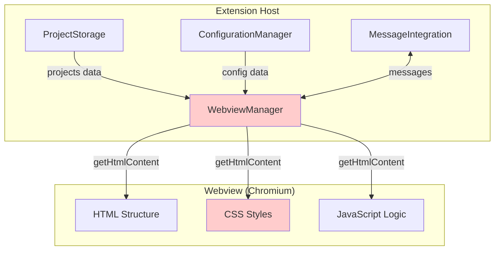

# Design Document

## Overview

本機能は、Start Board Extensionのダッシュボードにおけるレイアウト構造を改善し、ASCIIアート表示エリアを固定ヘッダーとして常時表示可能にします。現在の実装では画面全体がスクロール可能であり、プロジェクトリストが増えるとASCIIアートが画面外に消えてしまう問題があります。本設計では、CSS Flexboxと`overflow`プロパティを使用してレイアウトを2つの独立した領域に分割し、プロジェクトリスト部分のみをスクロール可能にすることで、視覚的なアイデンティティを維持しながら多数のプロジェクトにアクセス可能にします。

**Purpose**: ユーザーがプロジェクトリストをスクロールしている間も常にASCIIアートを表示し、ダッシュボードの視覚的な一貫性とユーザーエクスペリエンスを向上させます。

**Users**: Start Board Extensionを使用する開発者が、多数のプロジェクトを管理しながら視覚的にカスタマイズされたダッシュボードを利用します。

**Impact**: 既存のWebviewレイアウトのCSSスタイルを変更し、HTML構造とJavaScriptロジックは維持します。破壊的変更はなく、既存機能（プロジェクト追加/削除/オープン）への影響もありません。

### Goals

- ASCIIアート表示エリアを固定ヘッダーとして常時表示する
- プロジェクトリスト表示エリアのみを独立したスクロール領域として実装する
- スクロールバーをVSCodeテーマと調和させ、視覚的ノイズを最小化する
- ウィンドウリサイズ時に動的にレイアウトを調整し、レイアウトの崩れやちらつきを防止する
- セマンティックバージョニングに従いpackage.jsonのバージョン番号をマイナーバージョンアップする

### Non-Goals

- 仮想スクロール（大量プロジェクトの最適化）の実装（将来の機能として検討）
- ASCIIアート表示エリアのサイズ変更機能（現在のフォント設定のみ維持）
- プロジェクトリストのソート/フィルター機能（別の機能として実装予定）
- 外部CSSファイルの使用（CSP制約によりインラインCSSのみ）

## Architecture

### Existing Architecture Analysis

Start Board Extensionは、VSCode Extension APIを使用したイベント駆動型のシングルプロセスアーキテクチャです。WebviewによるカスタムビューとメッセージパッシングによるExtension Host ↔ Webview間通信を採用しています。

**現在のWebviewレイアウト構造**:
- `body`要素: `display: flex`, `flex-direction: column`, `min-height: 100vh`
- `splash-container`（ASCIIアート）: `flex: 0 0 auto`（固定サイズ）
- `project-list-container`（プロジェクトリスト）: `flex: 1 1 auto`（残りスペース占有）

**問題点**:
- `body`が`min-height: 100vh`のため、コンテンツが画面を超えると全体がスクロール可能になる
- `splash-container`の`flex: 0 0 auto`は固定意図だが、body自体がスクロールするため機能しない

**既存パターンの維持**:
- Flat Module Structure: src/直下に機能別モジュールを配置
- Inline HTML/CSS: WebviewのHTML/CSSは`WebviewManager.getHtmlContent()`メソッド内にテンプレート文字列として記述
- Message Protocol: Extension ↔ Webview間は型安全なメッセージで通信（変更なし）
- BEM風のCSSクラス命名規則

### Architecture Pattern & Boundary Map

本機能は既存アーキテクチャの拡張であり、新しいドメイン境界やコンポーネントの追加はありません。

**Architecture Integration**:
- **Selected pattern**: Inline CSS Template Extension（既存パターン）
- **Domain/feature boundaries**: WebviewManagerのHTML生成責務のみ変更、他のモジュール（ProjectStorage、ConfigurationManager、MessageIntegration）は影響なし
- **Existing patterns preserved**: Flat Module Structure、Inline HTML/CSS、Message Protocol、Dependency Injection
- **New components rationale**: なし（既存の`WebviewManager.getHtmlContent()`メソッドを拡張）
- **Steering compliance**: 既存のアーキテクチャパターンと技術スタックを維持、type safety（TypeScript strict mode）を継続



**変更箇所**: `WebviewManager.getHtmlContent()`メソッド内のCSSスタイル（赤色で強調）

### Technology Stack

| Layer | Choice / Version | Role in Feature | Notes |
|-------|------------------|-----------------|-------|
| Frontend | HTML/CSS (Inline) | Webviewレイアウト構造とスタイリング | CSS Flexbox、`overflow`プロパティ、カスタムスクロールバースタイル |
| Frontend | VSCode CSS Variables | テーマカラー適用 | `--vscode-scrollbarSlider-*`変数を使用 |
| Runtime | VSCode Webview (Chromium) | Webview実行環境 | `::-webkit-scrollbar`疑似要素サポート |
| Platform | VSCode Extension API 1.85+ | 拡張機能プラットフォーム | 変更なし |

**新規依存関係**: なし（既存の技術スタックのみ使用）

**クロスブラウザ対応**:
- 標準プロパティ: `scrollbar-width`, `scrollbar-color`（Firefox、2025年時点でクロスブラウザサポート）
- Webkit疑似要素: `::-webkit-scrollbar-*`（Chromium、Safari、Edge）
- 両方を併用してクロスブラウザ互換性を確保（詳細は`research.md`参照）

## Requirements Traceability

| Requirement | Summary | Components | Interfaces | Flows |
|-------------|---------|------------|------------|-------|
| 1.1 | ASCIIアートとプロジェクトリストを独立した領域に分割 | WebviewManager | getHtmlContent() | - |
| 1.2 | ASCIIアートを画面上部に固定配置 | WebviewManager | getHtmlContent() | - |
| 1.3 | ASCIIアートを常にビューポート内に表示 | WebviewManager | getHtmlContent() | - |
| 1.4 | プロジェクトリストをASCIIアート下に配置 | WebviewManager | getHtmlContent() | - |
| 2.1 | プロジェクトリストがビューポートを超える場合のみスクロール可能 | WebviewManager | getHtmlContent() | - |
| 2.2 | プロジェクトリストスクロール時にASCIIアート位置を固定 | WebviewManager | getHtmlContent() | - |
| 2.3 | 画面全体のスクロールを無効化 | WebviewManager | getHtmlContent() | - |
| 2.4 | プロジェクトリストがビューポート以下の場合スクロールバー非表示 | WebviewManager | getHtmlContent() | - |
| 3.1 | スクロールバーをVSCodeテーマと調和 | WebviewManager | getHtmlContent() | - |
| 3.2 | スクロールバーがコンテンツと重ならない | WebviewManager | getHtmlContent() | - |
| 3.3 | 非アクティブ時のスクロールバーを控えめに表示 | WebviewManager | getHtmlContent() | - |
| 3.4 | スクロールバー幅がプロジェクト名表示領域を圧迫しない | WebviewManager | getHtmlContent() | - |
| 4.1 | ウィンドウリサイズ時の動的高さ再計算 | WebviewManager | getHtmlContent() | - |
| 4.2 | 小さいウィンドウでの残り領域割り当て | WebviewManager | getHtmlContent() | - |
| 4.3 | 大きいウィンドウでのスクロールなし表示 | WebviewManager | getHtmlContent() | - |
| 4.4 | リサイズ時のレイアウト崩れ防止 | WebviewManager | getHtmlContent() | - |
| 5.1 | package.jsonバージョンのマイナーバージョンアップ | package.json | - | - |
| 5.2 | CHANGELOGエントリ追加（存在する場合） | CHANGELOG.md | - | - |

すべての要件は`WebviewManager.getHtmlContent()`メソッドのCSS変更により実現されます。

## Components and Interfaces

### Component Summary

| Component | Domain/Layer | Intent | Req Coverage | Key Dependencies | Contracts |
|-----------|--------------|--------|--------------|------------------|-----------|
| WebviewManager.getHtmlContent() | UI/Webview | Webview HTML/CSS生成 | 1.1-1.4, 2.1-2.4, 3.1-3.4, 4.1-4.4 | なし | Service [×] / API [×] / Event [×] / Batch [×] / State [×] |

本機能は既存の`WebviewManager.getHtmlContent()`メソッド内のCSS変更のみであり、新規コンポーネントの追加はありません。Service/API/Event/Batch/Stateの各契約は変更なしです。

### UI/Webview

#### WebviewManager.getHtmlContent()

| Field | Detail |
|-------|--------|
| Intent | Webview表示用のHTMLコンテンツ（HTML/CSS/JavaScript）を生成 |
| Requirements | 1.1, 1.2, 1.3, 1.4, 2.1, 2.2, 2.3, 2.4, 3.1, 3.2, 3.3, 3.4, 4.1, 4.2, 4.3, 4.4 |

**Responsibilities & Constraints**
- WebviewのHTML/CSS/JavaScriptテンプレート文字列を生成
- VSCodeテーマカラー（CSS変数）との連携
- CSP（Content Security Policy）制約内での実装（`style-src 'unsafe-inline'`のみ許可）

**Dependencies**
- Inbound: なし（privateメソッド）
- Outbound: なし
- External: VSCode CSS Variables（`--vscode-*`） — テーマカラー取得 (P0)

**Implementation Notes**

**変更内容（CSS）**:

1. **body要素のスタイル変更** (Req 1.2, 1.3, 2.3):
   ```css
   body {
     font-family: var(--vscode-font-family);
     color: var(--vscode-foreground);
     background-color: var(--vscode-editor-background);
     margin: 0;
     padding: 20px;
     display: flex;
     flex-direction: column;
     align-items: center;
     height: 100vh;          /* 変更: min-height → height */
     overflow: hidden;       /* 追加: 画面全体のスクロール無効化 */
     box-sizing: border-box;
   }
   ```

2. **splash-containerのスタイル維持** (Req 1.1, 1.4):
   ```css
   .splash-container {
     flex: 0 0 auto;         /* 変更なし: 固定サイズ */
     margin-bottom: 40px;
     text-align: center;
   }
   ```

3. **project-list-containerのスタイル変更** (Req 2.1, 2.2, 2.4):
   ```css
   .project-list-container {
     flex: 1 1 auto;         /* 変更なし: 残りスペース占有 */
     width: 100%;
     max-width: 600px;
     overflow-y: auto;       /* 追加: 縦スクロール有効化 */
   }
   ```

4. **カスタムスクロールバースタイル追加** (Req 3.1, 3.2, 3.3, 3.4):
   ```css
   /* 標準プロパティ（Firefox、クロスブラウザ） */
   .project-list-container {
     scrollbar-width: thin;
     scrollbar-color: var(--vscode-scrollbarSlider-background) transparent;
   }

   /* Webkit疑似要素（Chromium、Safari、Edge） */
   .project-list-container::-webkit-scrollbar {
     width: 10px;
   }

   .project-list-container::-webkit-scrollbar-track {
     background: transparent;
   }

   .project-list-container::-webkit-scrollbar-thumb {
     background: var(--vscode-scrollbarSlider-background);
     border-radius: 5px;
   }

   .project-list-container::-webkit-scrollbar-thumb:hover {
     background: var(--vscode-scrollbarSlider-hoverBackground);
   }

   .project-list-container::-webkit-scrollbar-thumb:active {
     background: var(--vscode-scrollbarSlider-activeBackground);
   }
   ```

**レイアウト応答性** (Req 4.1, 4.2, 4.3, 4.4):
- Flexboxの`flex: 1 1 auto;`により、`project-list-container`は`splash-container`の高さを引いた残りのスペースを自動占有
- ウィンドウリサイズ時、ブラウザのレイアウトエンジンが動的に高さを再計算（JavaScript不要）
- CSS `transition`プロパティは使用せず、ブラウザネイティブのレイアウト計算に委譲してちらつきを防止

**Integration**: 既存のHTML構造とJavaScriptロジックは変更なし、CSSのみ追加/変更

**Validation**:
- VSCode Developer Tools（`Developer: Open Webview Developer Tools`）でスタイルを検証
- 複数テーマ（Light、Dark、High Contrast）での視覚的確認
- 異なるウィンドウサイズでのレイアウト確認

**Risks**:
- 大量プロジェクト（100+）でのスクロールパフォーマンス → パフォーマンステストで検証、必要に応じて将来的に仮想スクロールを検討
- スクロールバーの視覚的ノイズ → `:hover`と`:active`状態で適切な強調表示を実装

## Error Handling

### Error Strategy

本機能はCSSスタイルの変更のみであり、実行時エラーは発生しません。CSSの構文エラーはブラウザが無視し、フォールバックスタイルが適用されます。

### Error Categories and Responses

**CSS構文エラー**:
- ブラウザがパースエラーを無視し、該当ルールをスキップ
- 既存のスタイルまたはブラウザデフォルトスタイルが適用される
- Developer Toolsで構文エラーを確認可能

**VSCodeテーマ変数の未定義**:
- CSS変数が未定義の場合、透明（`transparent`）またはブラウザデフォルトカラーが使用される
- 視覚的な問題はあるが、機能的には影響なし

### Monitoring

- VSCode Developer Tools（`Developer: Open Webview Developer Tools`）でCSSエラーを確認
- 複数テーマでの視覚的検証

## Testing Strategy

### Unit Tests
本機能はCSSのみの変更のため、従来のユニットテストは不要です。

### Integration Tests
- **HTMLスナップショットテスト**: `webviewManager.test.ts`でHTML出力のスナップショットを更新
  - `getHtmlContent()`メソッドのHTML出力が期待通りのCSS変更を含むことを検証
  - 既存のHTMLスナップショットテストを更新（CSSの追加/変更を反映）

### Visual/Manual Tests
- **複数テーマでの視覚的検証**:
  - Light、Dark、High Contrastテーマでスクロールバーのスタイルを確認
  - `--vscode-scrollbarSlider-*`変数が正しく適用されているか検証
- **ウィンドウリサイズテスト**:
  - 小さいウィンドウ（縦幅400px）でプロジェクトリストのスクロールを確認
  - 大きいウィンドウ（縦幅1200px）でスクロールバー非表示を確認
  - リサイズ中のレイアウト崩れやちらつきがないか確認
- **スクロール動作テスト**:
  - プロジェクトリストをスクロールしてASCIIアートが固定されているか確認
  - ホバー時のスクロールバースタイル変化を確認
  - 画面全体のスクロールが無効化されているか確認

### Performance Tests
- **大量プロジェクトでのスクロールパフォーマンス**:
  - 100+プロジェクトをロードしてスクロールのフレームレートを測定
  - Chrome DevToolsのPerformanceタブでレンダリングパフォーマンスを確認
  - 60fps以下になる場合は将来的に仮想スクロールを検討

## Optional Sections

### Performance & Scalability

**Target Metrics**:
- スクロールパフォーマンス: 60fps維持（100プロジェクトまで）
- レイアウト計算: ウィンドウリサイズ時の再計算16ms以内（60fps）

**Optimization Techniques**:
- CSS Flexboxによる動的高さ計算（JavaScript不要）
- ブラウザネイティブのレイアウトエンジンに委譲
- `will-change`プロパティは使用しない（過度な最適化を避ける）

**Scalability Considerations**:
- 100+プロジェクトでパフォーマンス低下が発生する場合、将来的に仮想スクロール（react-windowなど）を検討
- 現時点では標準的なDOMレンダリングで十分なパフォーマンスを達成予定

## Supporting References

### VSCode Theme Variables

主要なスクロールバー関連のテーマ変数:
- `--vscode-scrollbarSlider-background`: スクロールバーのthumb（ドラッグ可能部分）の背景色
- `--vscode-scrollbarSlider-hoverBackground`: ホバー時のthumb背景色
- `--vscode-scrollbarSlider-activeBackground`: アクティブ時（ドラッグ中）のthumb背景色

これらの変数はVSCodeが自動的にWebviewに注入し、現在のテーマに応じて動的に変更されます。

### CSS Flexbox Layout Model

本設計で使用するFlexboxの主要プロパティ:
- `display: flex`: フレックスコンテナを作成
- `flex-direction: column`: 縦方向のレイアウト
- `flex: 0 0 auto`: 固定サイズ（成長なし、縮小なし、自動サイズ）
- `flex: 1 1 auto`: 残りスペースを占有（成長あり、縮小あり、自動サイズ）
- `height: 100vh`: ビューポート高さの100%
- `overflow: hidden`: スクロールを無効化
- `overflow-y: auto`: 縦スクロールのみ有効化（コンテンツが溢れた場合のみ）

