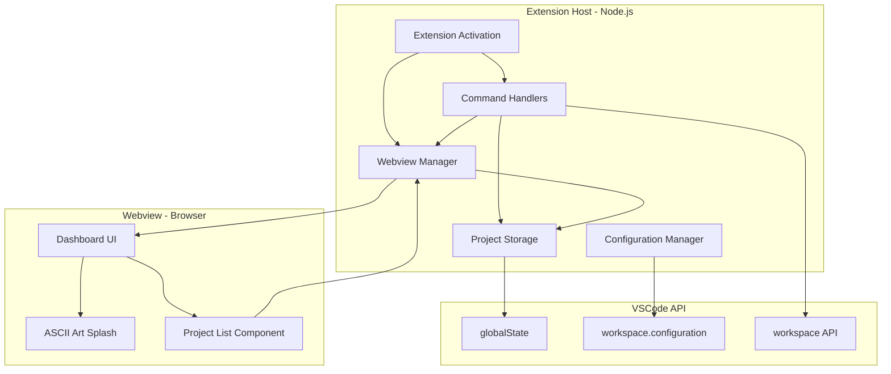
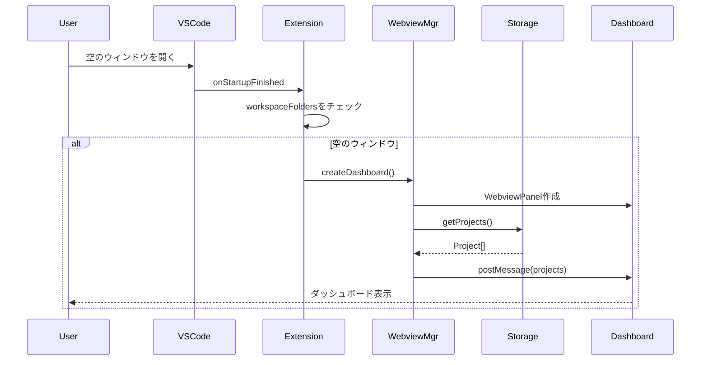
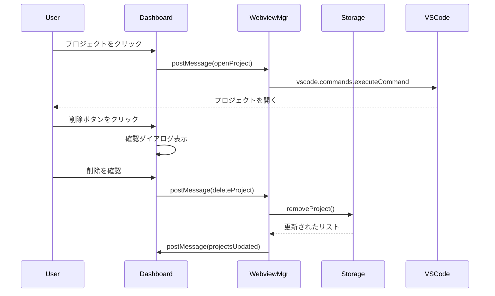
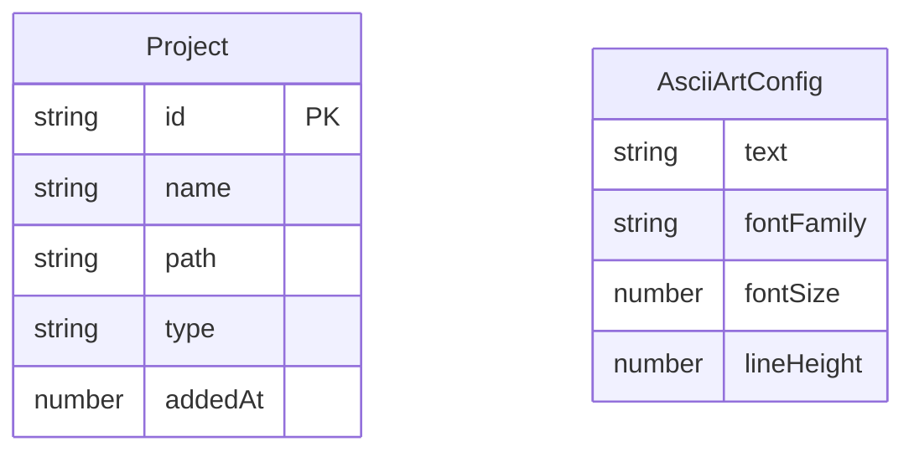

# Design Document

## Overview

**Purpose**: この機能は、VSCodeで空のウィンドウを開いた際にカスタマイズ可能なダッシュボードを表示し、プロジェクトへの素早いアクセスを提供する。

**Users**: VSCodeユーザーが頻繁にアクセスするプロジェクトの管理とナビゲーションに利用する。

**Impact**: 空のウィンドウ起動時のユーザー体験を向上させ、プロジェクト切り替えのワークフローを効率化する。

### Goals
- 空のウィンドウを開いた際にWebviewダッシュボードを自動表示
- カスタマイズ可能なアスキーアートスプラッシュスクリーンを提供
- プロジェクトリストの永続化と管理機能を実装
- ワンクリックでプロジェクトを開く機能を提供

### Non-Goals
- リモートワークスペースのサポート（将来の拡張）
- プロジェクトのグループ化・タグ付け機能
- 最近開いたファイルの表示
- プロジェクト検索機能

## Architecture

### Architecture Pattern & Boundary Map

**Architecture Integration**:
- Selected pattern: Simple Module Pattern — 機能ごとにモジュール分割し、VSCode拡張機能の標準的なアプローチに従う
- Domain/feature boundaries: Extension Host（Node.js）とWebview（ブラウザ環境）の分離
- New components rationale: Webview管理、プロジェクトストレージ、コマンド処理の責務分離



### Technology Stack

| Layer | Choice / Version | Role in Feature | Notes |
|-------|------------------|-----------------|-------|
| Extension Runtime | Node.js (VSCode組み込み) | 拡張機能ホスト環境 | VSCodeが管理 |
| Extension Language | TypeScript 5.x | 型安全な拡張機能開発 | VSCode推奨 |
| UI Framework | Vanilla HTML/CSS/JS | Webviewダッシュボード | Webview UI Toolkit非推奨のため |
| Data Storage | VSCode globalState API | プロジェクトリスト永続化 | SQLiteベース |
| Configuration | VSCode Configuration API | ユーザー設定管理 | package.json定義 |
| Build Tool | esbuild / webpack | バンドル | VSCode拡張機能標準 |

## System Flows

### ダッシュボード表示フロー



### プロジェクト操作フロー



## Requirements Traceability

| Requirement | Summary | Components | Interfaces | Flows |
|-------------|---------|------------|------------|-------|
| 1.1 | 空のウィンドウでダッシュボード表示 | WebviewManager, Extension | - | ダッシュボード表示フロー |
| 1.2 | エディター領域に全画面表示 | WebviewManager | WebviewPanel options | - |
| 1.3 | スプラッシュとプロジェクトリスト含む | Dashboard UI | - | - |
| 2.1 | アスキーアート表示 | Dashboard UI, SplashScreen | - | - |
| 2.2-2.5 | アスキーアート設定 | ConfigurationManager | ExtensionConfig | - |
| 2.6 | 設定変更時の再描画 | WebviewManager, Dashboard | WebviewMessage | - |
| 3.1-3.4 | プロジェクトデータ管理 | ProjectStorage | Project, StorageService | - |
| 4.1-4.4 | プロジェクト追加コマンド | CommandHandlers | Command registration | - |
| 5.1-5.3 | プロジェクトリスト表示 | Dashboard UI, ProjectList | WebviewMessage | - |
| 6.1-6.4 | プロジェクト削除 | Dashboard UI, ProjectStorage | WebviewMessage | プロジェクト操作フロー |
| 7.1-7.3 | プロジェクトを開く | WebviewManager, CommandHandlers | WebviewMessage | プロジェクト操作フロー |

## Components and Interfaces

| Component | Domain/Layer | Intent | Req Coverage | Key Dependencies | Contracts |
|-----------|--------------|--------|--------------|------------------|-----------|
| Extension | Core | 拡張機能エントリーポイント、初期化 | 1.1 | VSCode API (P0) | - |
| WebviewManager | UI | Webviewパネルの作成と管理 | 1.1, 1.2, 1.3, 2.6, 7.1, 7.3 | VSCode Webview API (P0) | Service, State |
| ProjectStorage | Data | プロジェクトリストの永続化 | 3.1, 3.2, 3.3, 3.4, 6.3 | globalState (P0) | Service |
| ConfigurationManager | Config | ユーザー設定の読み取りと監視 | 2.2, 2.3, 2.4, 2.5, 2.6 | workspace.getConfiguration (P0) | Service |
| CommandHandlers | Command | VSCodeコマンドの登録と処理 | 4.1, 4.2, 4.3, 4.4 | vscode.commands (P0) | - |
| Dashboard UI | Webview | メインダッシュボードUI | 1.3, 5.1, 5.2, 5.3 | - | - |
| SplashScreen | Webview | アスキーアート表示 | 2.1 | - | - |
| ProjectList | Webview | プロジェクト一覧表示 | 5.1, 5.2, 5.3, 6.1, 6.2, 6.4, 7.1 | - | - |

### Extension Host Layer

#### WebviewManager

| Field | Detail |
|-------|--------|
| Intent | Webviewパネルのライフサイクル管理とメッセージ通信 |
| Requirements | 1.1, 1.2, 1.3, 2.6, 7.1, 7.3 |

**Responsibilities & Constraints**
- WebviewPanelの作成、表示、破棄を管理
- Extension ⇔ Webview間のメッセージパッシング
- 設定変更時のWebview更新
- 単一インスタンスの保証（シングルトン）

**Dependencies**
- Inbound: Extension — 初期化とライフサイクル (P0)
- Inbound: CommandHandlers — プロジェクト追加通知 (P1)
- Outbound: ProjectStorage — プロジェクトデータ取得 (P0)
- Outbound: ConfigurationManager — 設定値取得 (P0)
- External: vscode.window.createWebviewPanel — Webview作成 (P0)

**Contracts**: Service [x] / State [x]

##### Service Interface
```typescript
interface WebviewManagerService {
  showDashboard(): Promise<void>;
  hideDashboard(): void;
  isVisible(): boolean;
  sendMessage(message: ExtensionToWebviewMessage): void;
  onMessage(handler: (message: WebviewToExtensionMessage) => void): vscode.Disposable;
}
```
- Preconditions: ExtensionContextが初期化済み
- Postconditions: Webviewが表示/非表示状態になる
- Invariants: 同時に1つのダッシュボードのみ存在

##### State Management
- State model: WebviewPanel reference, visibility flag
- Persistence: Webview stateはgetState/setStateで管理
- Concurrency: シングルスレッド（VSCode Extension Host）

**Implementation Notes**
- Integration: `vscode.window.createWebviewPanel`でパネル作成、`enableScripts: true`を設定
- Validation: メッセージ受信時に型チェック
- Risks: Webviewのメモリリーク — `panel.onDidDispose`で適切にクリーンアップ

#### ProjectStorage

| Field | Detail |
|-------|--------|
| Intent | プロジェクトリストの永続化と操作 |
| Requirements | 3.1, 3.2, 3.3, 3.4, 4.2, 4.4, 6.3 |

**Responsibilities & Constraints**
- globalStateへのプロジェクトリスト保存/読み込み
- プロジェクトの追加、削除、一覧取得
- 重複チェック（パスベース）
- データの整合性保証

**Dependencies**
- Inbound: WebviewManager — CRUD操作 (P0)
- Inbound: CommandHandlers — プロジェクト追加 (P0)
- External: ExtensionContext.globalState — 永続化 (P0)

**Contracts**: Service [x]

##### Service Interface
```typescript
interface Project {
  id: string;
  name: string;
  path: string;
  type: 'folder' | 'workspace';
  addedAt: number;
}

interface ProjectStorageService {
  getProjects(): Project[];
  addProject(project: Omit<Project, 'id' | 'addedAt'>): Project | null;
  removeProject(id: string): boolean;
  hasProject(path: string): boolean;
}
```
- Preconditions: ExtensionContextが初期化済み
- Postconditions: 変更がglobalStateに永続化される
- Invariants: 同一パスのプロジェクトは1つのみ存在

**Implementation Notes**
- Integration: `context.globalState.get/update`でデータ管理
- Validation: パスの存在確認は呼び出し側（CommandHandlers）で実施
- Risks: データ破損 — JSON構造の検証を実装

#### ConfigurationManager

| Field | Detail |
|-------|--------|
| Intent | ユーザー設定の読み取りと変更監視 |
| Requirements | 2.2, 2.3, 2.4, 2.5, 2.6 |

**Responsibilities & Constraints**
- VSCode設定からアスキーアート関連設定を取得
- 設定変更イベントの監視と通知
- デフォルト値の提供

**Dependencies**
- Inbound: WebviewManager — 設定値取得 (P0)
- External: vscode.workspace.getConfiguration — 設定読み取り (P0)
- External: vscode.workspace.onDidChangeConfiguration — 変更監視 (P0)

**Contracts**: Service [x]

##### Service Interface
```typescript
interface AsciiArtConfig {
  text: string;
  fontFamily: string;
  fontSize: number;
  lineHeight: number;
}

interface ConfigurationManagerService {
  getAsciiArtConfig(): AsciiArtConfig;
  onConfigChange(handler: (config: AsciiArtConfig) => void): vscode.Disposable;
}
```
- Preconditions: なし
- Postconditions: 設定値が返される（デフォルト値保証）
- Invariants: 常に有効な設定値を返す

**Implementation Notes**
- Integration: `vscode.workspace.getConfiguration('startBoard')`で設定取得
- Validation: 数値範囲のバリデーション（fontSize > 0, lineHeight > 0）
- Risks: なし

#### CommandHandlers

| Field | Detail |
|-------|--------|
| Intent | VSCodeコマンドの登録と実行 |
| Requirements | 4.1, 4.2, 4.3, 4.4 |

**Responsibilities & Constraints**
- `startBoard.addProject`コマンドの登録
- 現在のワークスペース/フォルダの取得
- エラーハンドリングとユーザー通知

**Dependencies**
- Inbound: Extension — コマンド登録 (P0)
- Outbound: ProjectStorage — プロジェクト追加 (P0)
- Outbound: WebviewManager — UI更新通知 (P1)
- External: vscode.commands.registerCommand — コマンド登録 (P0)
- External: vscode.workspace.workspaceFolders — 現在のワークスペース取得 (P0)

**Contracts**: なし（VSCodeコマンドシステムに統合）

**Implementation Notes**
- Integration: `vscode.commands.registerCommand`でコマンド登録
- Validation: `workspaceFolders`がundefinedまたは空の場合はエラー表示
- Risks: なし

### Webview Layer

#### Dashboard UI

| Field | Detail |
|-------|--------|
| Intent | メインダッシュボードのレイアウトと統合 |
| Requirements | 1.3, 5.1, 5.2, 5.3 |

**Responsibilities & Constraints**
- スプラッシュスクリーンとプロジェクトリストのレイアウト
- VSCodeテーマとの統合（CSS変数使用）
- レスポンシブデザイン

**Implementation Notes**
- VSCodeのCSS変数（`--vscode-*`）を使用してテーマ対応
- フレックスボックスでレイアウト構成
- Webview内でのメッセージハンドリング

#### SplashScreen Component

| Field | Detail |
|-------|--------|
| Intent | アスキーアートの表示 |
| Requirements | 2.1 |

**Implementation Notes**
- `<pre>`タグでアスキーアートを表示
- 設定から取得したフォント、サイズ、ライン幅を適用
- テキストの中央配置

#### ProjectList Component

| Field | Detail |
|-------|--------|
| Intent | プロジェクト一覧の表示と操作 |
| Requirements | 5.1, 5.2, 5.3, 6.1, 6.2, 6.4, 7.1 |

**Implementation Notes**
- プロジェクトアイテムのリスト表示
- ホバー時に削除ボタン表示（CSS `:hover`）
- クリックでプロジェクトを開く
- 空リスト時のプレースホルダー表示

## Data Models

### Domain Model



**Entities**:
- **Project**: プロジェクト情報を表すエンティティ
  - `id`: 一意識別子（UUID）
  - `name`: 表示名（フォルダ名またはワークスペース名）
  - `path`: ファイルシステムパス
  - `type`: 'folder' | 'workspace'
  - `addedAt`: 追加日時（Unix timestamp）

**Value Objects**:
- **AsciiArtConfig**: アスキーアート表示設定

### Data Contracts & Integration

#### Message Protocol (Extension ⇔ Webview)

```typescript
// Extension → Webview
type ExtensionToWebviewMessage =
  | { type: 'init'; projects: Project[]; config: AsciiArtConfig }
  | { type: 'projectsUpdated'; projects: Project[] }
  | { type: 'configUpdated'; config: AsciiArtConfig };

// Webview → Extension
type WebviewToExtensionMessage =
  | { type: 'openProject'; projectId: string }
  | { type: 'deleteProject'; projectId: string }
  | { type: 'ready' };
```

#### Storage Schema (globalState)

```typescript
// Key: 'startBoard.projects'
type StoredProjects = Project[];
```

## Error Handling

### Error Strategy
- ユーザーエラー: `vscode.window.showErrorMessage`で通知
- システムエラー: ログ出力 + グレースフルデグラデーション

### Error Categories and Responses
- **User Errors**:
  - ワークスペース未オープン時のプロジェクト追加 → エラーメッセージ表示
  - 存在しないプロジェクトパス → エラーメッセージ + リストから削除オプション
- **Business Logic Errors**:
  - 重複プロジェクト追加 → 警告メッセージ「既に追加されています」

### Monitoring
- Extension Host Output Channelへのログ出力（開発/デバッグ用）

## Testing Strategy

### Unit Tests
- ProjectStorage: CRUD操作、重複チェック、永続化
- ConfigurationManager: 設定読み取り、デフォルト値
- Message Protocol: 型検証、シリアライゼーション

### Integration Tests
- WebviewManager: パネル作成、メッセージ送受信
- CommandHandlers: コマンド実行、ProjectStorage連携
- 空のウィンドウ検出 → ダッシュボード表示フロー

### E2E Tests
- 空のウィンドウ起動 → ダッシュボード表示
- プロジェクト追加コマンド → リスト更新
- プロジェクトクリック → ウィンドウ遷移
- 削除ボタン → 確認ダイアログ → 削除

## Configuration Schema (package.json)

```json
{
  "contributes": {
    "configuration": {
      "title": "Start Board",
      "properties": {
        "startBoard.asciiArt.text": {
          "type": "string",
          "default": "Welcome",
          "description": "アスキーアートとして表示するテキスト"
        },
        "startBoard.asciiArt.fontFamily": {
          "type": "string",
          "default": "monospace",
          "description": "アスキーアートのフォントファミリー"
        },
        "startBoard.asciiArt.fontSize": {
          "type": "number",
          "default": 14,
          "minimum": 8,
          "maximum": 72,
          "description": "アスキーアートのフォントサイズ（px）"
        },
        "startBoard.asciiArt.lineHeight": {
          "type": "number",
          "default": 1.2,
          "minimum": 0.5,
          "maximum": 3,
          "description": "アスキーアートの行の高さ"
        }
      }
    },
    "commands": [
      {
        "command": "startBoard.addProject",
        "title": "Start Board: 現在のプロジェクトを追加"
      },
      {
        "command": "startBoard.showDashboard",
        "title": "Start Board: ダッシュボードを表示"
      }
    ]
  },
  "activationEvents": [
    "onStartupFinished"
  ]
}
```
